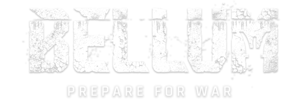
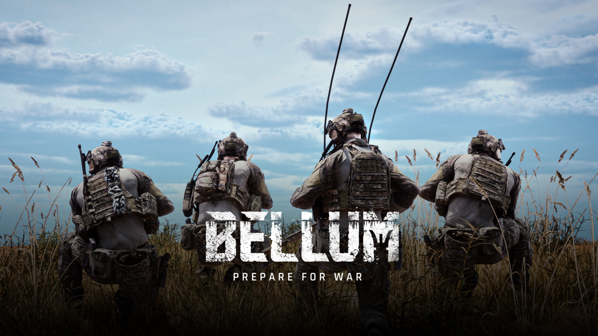
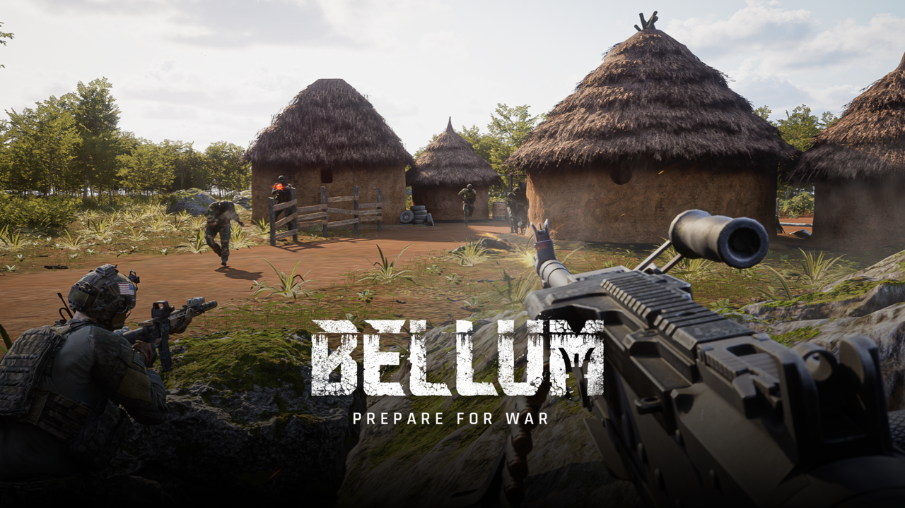
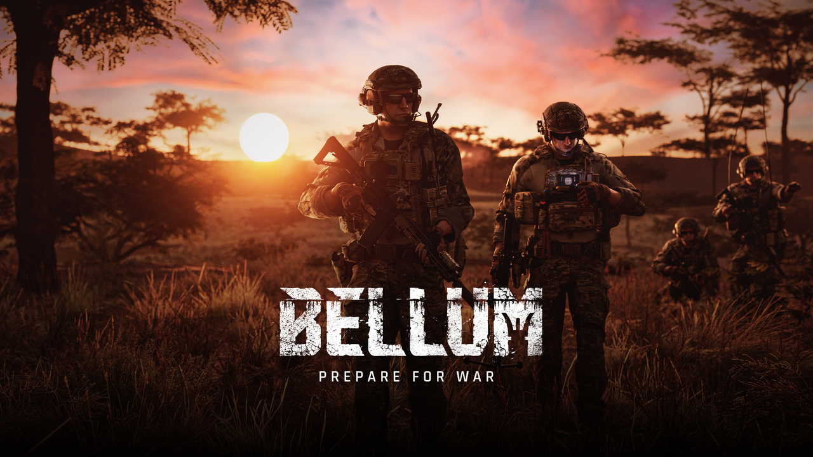

<p align="center">
  
</p>

<p align="center">
  <b>Bellum on Linux. No Windows required.</b>
</p>

<p align="center">
  
</p>

---

## About

A GTK4 application to install, configure, and manage [Bellum](https://store.steampowered.com/app/Bellum) via Wine and Proton on Linux.

Built upon the foundational work by Joe Paji ([joepaji/bellum-linux-installer](https://github.com/joepaji/bellum-linux-installer)), TuxBellum provides a native graphical interface to simplify the entire process. It handles GPU detection, Proton patching, WINEPREFIX configuration, and desktop integration.

---

## Features

- Hardware detection for NVIDIA, AMD, and Intel GPUs
- Automated download and patching of Proton-CachyOS
- WINEPREFIX initialization with all required DLLs (vcrun, d3dcompiler, faudio, dotnet, mfc)
- Hands-free Astarte Launcher installation via Proton
- Configurable support for Gamescope, Gamemode, HDR, NVAPI, and FSR 4.1
- Automatic creation of desktop shortcuts, application menu entries, and a unified `Bellum` launcher script
- Settings dialog to toggle launch options without reinstalling

<p align="center">
  
</p>

---

## System Requirements

TuxBellum requires specific system-level packages that cannot be installed via `pip`.

### UI Dependencies (GTK4 + PyGObject)

| Distro | Command |
|---|---|
| Arch / Manjaro / CachyOS | `sudo pacman -S python-gobject gtk4` |
| Debian / Ubuntu | `sudo apt install python3-gi gir1.2-gtk-4.0 libgtk-4-1` |
| Fedora | `sudo dnf install python3-gobject gtk4` |

### Runtime Dependencies

| Package | Purpose | Minimum Version |
|---|---|---|
| `wine` | Windows compatibility layer | >= 11.0 |
| `winetricks` | DLL/component installer | any |
| `umu-launcher` | Proton container launcher | >= 1.3.0 |
| `mesa-utils` | GPU detection via `glxinfo` | any |
| `wget` | Proton/launcher downloads | any |
| `tar` | Archive extraction | any |

### Optional Enhancements

| Package | Purpose |
|---|---|
| `gamescope` | Compositor for HDR, resolution scaling |
| `gamemode` | CPU/GPU performance governor |
| `mangohud` | In-game performance overlay |

---

## Installation

### Install Script (Recommended)

Detects your distribution, installs system dependencies via `apt`/`pacman`/`dnf`, and installs the Python package for your user.

```bash
curl -fsSL https://raw.githubusercontent.com/Ch3w3y/tuxbellum/main/install.sh | bash
```

### AppImage

Download the latest AppImage from [Releases](https://github.com/Ch3w3y/tuxbellum/releases):

```bash
chmod +x TuxBellum-*.AppImage
./TuxBellum-*.AppImage
```

### Manual Installation (Pip)

Ensure you have installed the system UI and runtime dependencies listed above first.

```bash
git clone https://github.com/Ch3w3y/tuxbellum.git
cd tuxbellum
pip install -e . --break-system-packages
```

### AUR (Arch Linux)

```bash
yay -S tuxbellum
```


---

## Usage

Launch the application from your desktop environment's application menu (under the Games category) or from a terminal:

```bash
tuxbellum
```

After a successful installation, launch the game via the generated desktop shortcut, application menu entry, or the unified wrapper script:

```bash
Bellum
```

### Changing Launch Options

Open **Settings** from the main menu to toggle Gamescope, Gamemode, HDR, NVAPI, and FSR 4.1. Changes are applied immediately to the next launch without requiring a reinstall.

<p align="center">
  
</p>

---

## Known Issues

| Issue | Details |
|---|---|
| **NVIDIA 5000 Series** | Driver 595 breaks UE5 shader compilation under Proton. Downgrade to driver 590 until an upstream fix is released. |
| **Gamescope cursor** | On some Wayland compositors the cursor may be invisible. TuxBellum passes `--force-grab-cursor` by default to mitigate this. |
| **Gamescope unfocused throttle** | Gamescope throttles to 0 FPS when not focused. TuxBellum passes `--fps-limit-when-unfocused=0` to prevent this. |

---

## Credits

This project refactors and consolidates the original work by **Joe Paji** ([joepaji/bellum-linux-installer](https://github.com/joepaji/bellum-linux-installer)). Joe performed the foundational reverse-engineering required to run Bellum under Wine/Proton, including DXVK patches, winetricks modifications, and FSR integration.

If you appreciate having Bellum on Linux, consider supporting Joe's ongoing efforts:

- [Ko-fi](https://ko-fi.com/K3K210EMDU)
- [PayPal](https://www.paypal.com/donate/?business=57PP9DVD3VWAN&no_recurring=0&currency_code=USD)

---

## License

Apache 2.0. See [LICENSE](LICENSE).
